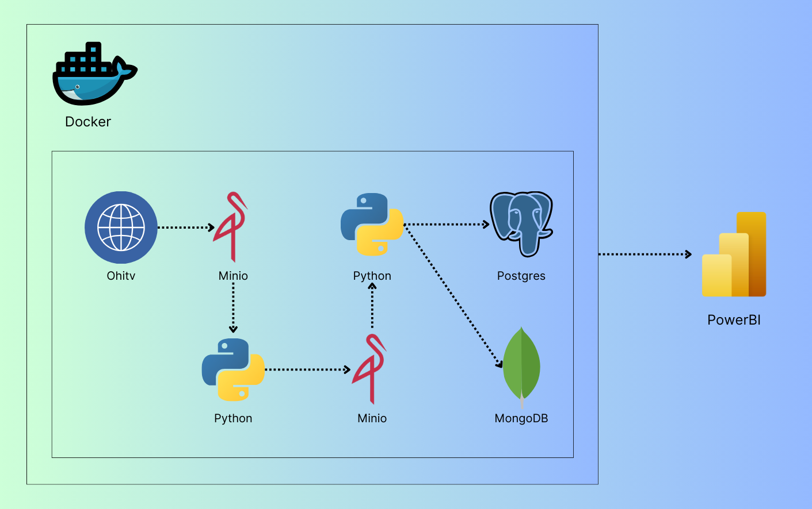

# Ohitv End To End Project

# Film Information Crawling and ETL Project

## Objective
Crawl film information from [Ohitv.info](https://ohitv.info) and incrementally load updates daily into Postgres and MongoDB for analysis and visualization.

---

## Tech Stack
- **Docker**: Manages services like Airflow, Minio, Postgres, and MongoDB.
- **Airflow**: Orchestrates the ETL pipeline.
- **Minio**: Object storage for raw and processed data.
- **Postgres**: Relational database to store processed data.
- **MongoDB**: NoSQL database for testing queries and learning.
- **PowerBI**: Visualizes insights from the data.
- **Python**: Language used for scripting.

---

## Libraries
- `BeautifulSoup`
- `pandas`
- `numpy`
- `requests`

---

## Workflow

### 1. Extraction
- Crawl film data from [Ohitv.info](https://ohitv.info) using `requests` and `BeautifulSoup`.
- Save the raw data to Minio under the bucket `ohitv-raw`.

### 2. Transformation
- Use Python to clean and transform the data.
- Store the transformed data in Minio under the bucket `ohitv-processed`.

### 3. Load
- Load transformed data into Postgres for visualization and analysis with PowerBI.
- Load data into MongoDB to test and learn NoSQL querying.

### 4. Visualization
- Use PowerBI to visualize and report insights from the data stored in Postgres.

### 5. Orchestration
- Use Apache Airflow to manage and orchestrate the ETL pipeline, which runs daily.

---

## Setup Guide

### 1. Install Docker
- Follow the instructions to install Docker from the [Docker website](https://www.docker.com/).

---

### 2. Running the Application

#### 2.1. Windows:
- Run the `docker_compose.bat` file.

#### 2.2. MacOS/Linux:
- Run the `docker_compose.sh` file.

---

### 3. Access Minio
- Open Minio in your browser at `localhost:9001`.
- **Login**: 
  - Username: `admin12345`
  - Password: `admin12345`
- **Create Access Keys**:
  - Navigate to "Access Keys" in the left menu and generate new access and secret keys.
  - Make sure to store these keys securely.

---

### 4. Configure `keys.json`
- Create a `keys.json` file in the `plugins` directory with the following content:

```json
{
  "access_key": "replace your access_key",
  "secret_key": "replace your secret_key",
  "mongodb_user": "admin",
  "mongodb_password": "admin",
  "postgres_user": "airflow",
  "postgres_password": "airflow"
}
```

### 5. Access Airflow
- Open Airflow in your browser at `localhost:8080`
- `Run the Pipeline`: Click the `Run` button on the DAG to execute the workflow.


## My Project Flow Chart


## My Project Ohitv Report
